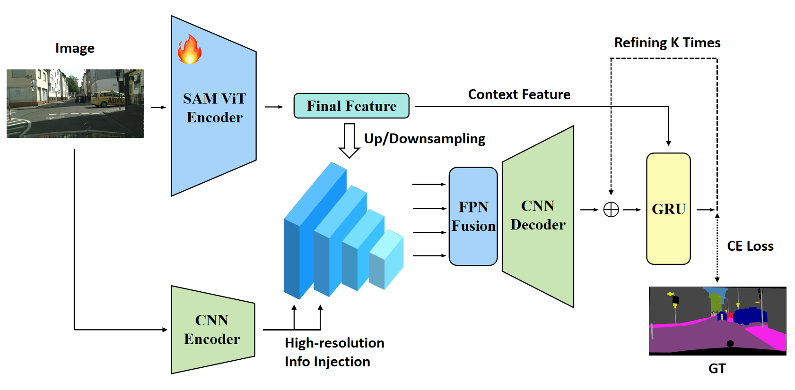

# ReFuseNet

> **Course project** for *Image Processing and Machine Vision* (IPMV),
> Fudan University, Spring 2026.

Refined Feature Fusion for transferring the Segment Anything Model (SAM ViT-B) to
small-scale semantic segmentation. This repository contains the training,
evaluation, and analysis code, together with the LaTeX sources of the paper.

**Paper**: [`docs/paper.pdf`](./docs/paper.pdf) 

## Model Architecture

ReFuseNet keeps the SAM ViT-B image encoder and adds a small, lightweight
decoder on top. The recommended `C4` variant runs a parallel CNN image branch
at native resolution, fuses it with the projected SAM semantic features through
an FPN-style pyramid, and iteratively refines the head-resolution logits with
a GRU. The other variants (`S0`–`S6`, `C2`, `T1`) ablate pieces of this design
(pseudo multi-scale pyramids, intermediate SAM features, DPT-style decoders,
auxiliary boundary heads, etc.) — see the [Models](#models) section.



## Main Results

Across the two datasets, `C4` is the strongest SAM-based variant while keeping
the parameter budget in the same range as the smaller variants. Cityscapes
pretraining followed by CamVid fine-tuning (`C4*`) further pushes CamVid to
**84.45 mIoU**.

| Method | Params (M) | CamVid mIoU (%) | CamVid Pixel Acc. (%) | Cityscapes mIoU (%) | Cityscapes Pixel Acc. (%) |
| --- | ---: | ---: | ---: | ---: | ---: |
| FCN-ResNet50 | 32.95 | 75.91 | 94.81 | 73.50 | 95.55 |
| SegFormer-B5 | 84.60 | 77.92 | 95.60 | **80.74** | 96.51 |
| ReFuseNet S0 | 90.15 | 75.91 | 95.04 | 59.11 | 93.95 |
| ReFuseNet S1 | 90.16 | 81.79 | 96.39 | 78.14 | 96.35 |
| ReFuseNet S2 | 90.25 | 81.55 | 96.42 | 78.27 | 96.46 |
| ReFuseNet S3 | 90.52 | 80.53 | 96.26 | 77.42 | 96.36 |
| ReFuseNet C2 | 91.80 | 82.06 | 96.58 | 78.69 | 96.58 |
| **ReFuseNet C4** | 92.07 | 82.07 | 96.40 | 78.72 | 96.58 |
| ReFuseNet T1 | 93.03 | 78.09 | 95.90 | 76.43 | 96.04 |
| **ReFuseNet C4\*** | 92.07 | **84.45** | **96.87** | -- | -- |

`C4*` is `C4` pretrained on Cityscapes (50 epochs) and then fine-tuned on
CamVid for 50 epochs. 

## Setup

```bash
conda create -n refusenet python=3.10 -y
conda activate refusenet
pip install -r requirements.txt
```

ReFuseNet needs the SAM ViT-B checkpoint here:

```text
checkpoints/sam_vit_b_01ec64.pth
```

W&B is enabled by default:

```bash
export WANDB_API_KEY=<wandb_api_key>
export WANDB_PROJECT=refusenet
```

Disable per run with `--wandb off`.

## Data

Expected layout:

```text
data/
├── CamVid/
│   ├── train/images/
│   ├── train/labels/
│   ├── test/images/
│   └── test/labels/
└── Cityscapes/
    ├── leftImg8bit/
    │   ├── train/<city>/
    │   └── val/<city>/
    └── gtFine/
        ├── train/<city>/
        └── val/<city>/
```

CamVid masks may be grayscale ids or RGB masks. Valid classes are `0..10`; void is `255`.

Cityscapes configs use `dataset.label_format: trainIds`, so they read `*_gtFine_labelTrainIds.png` directly. Generate those masks with the official scripts:

```bash
pip install cityscapesscripts
CITYSCAPES_DATASET=data/Cityscapes python -m cityscapesscripts.preparation.createTrainIdLabelImgs
```

The Cityscapes loader only scans `leftImg8bit/<split>` and never falls back to `gtFine` images.

## Models

| Setting | Structure |
| --- | --- |
| FCN | torchvision FCN-ResNet50 |
| SegFormer-B5 | HuggingFace `nvidia/mit-b5` |
| S0 | frozen SAM + final feature + legacy decoder |
| S1 | SAM low-LR fine-tune + final feature |
| S2 | SAM low-LR fine-tune + pseudo pyramid `256/128/64/32` |
| S3 | SAM intermediate layers + multiscale fusion |
| S4 | S2 + GRU refinement at `256x256` head logits |
| S5 | SAM intermediate layers + DPT fusion |
| S6 | S1 final feature + independent segmentation and boundary decoder heads |
| C2 | SAM final feature + lightweight CNN `256/128` scales + SAM-projected `64/32` scales + FPN fusion |
| C4 | C2 + GRU refinement; GRU context uses only SAM final feature projection |
| T1 | SAM final feature + lightweight Segmenter-style transformer decoder |

For S1-S6 and C2/C4, the classifier input is always:

```text
semantic_features: [B, head_channels=64, 256, 256]
```

S4 refines head-resolution logits, while S5 uses the DPT decoder without refinement.
S6 takes the S1 decoder feature `F`, sends it through separate segmentation and boundary decoder heads, and predicts `semantic logits` and `boundary_logits` independently. Its boundary target is generated from adjacent GT label changes while ignoring `255`, then dilated by `boundary_dilation` pixels. Boundary supervision uses `BCEWithLogitsLoss(pos_weight=neg/pos)` and the total loss is `CE(seg_logits, target) + lambda_boundary * boundary_loss`; the current S6 configs use `lambda_boundary: 0.1` and `boundary_dilation: 3`.
C4 follows the same head-resolution GRU path, but uses a SAM-final-only `gru_context` instead of the fused decoder feature as refinement context.

T1 replaces the whole semantic decoder with a compact Segmenter-style mask transformer:

```text
SAM final feature: [B, 256, 64, 64]
patch tokens + class tokens -> 4 transformer blocks -> logits [B, num_classes, 64, 64]
```

T1 does not use the shared classifier, GRU, CNN pyramid, DPT fusion, or boundary head.

## Config Defaults

| Dataset | Epochs | Eval Every | Save Every | Eval |
| --- | ---: | ---: | ---: | --- |
| CamVid | 200 | 10 | 50 | whole image |
| Cityscapes | 50 | 5 | 50 | sliding, crop `1024`, stride `768`, eval batch `1` |

Batch and accumulation:

| Model | Batch | Grad Accum |
| --- | ---: | ---: |
| FCN | 8 | 1 |
| SegFormer-B5 | 4 | 2 |
| ReFuseNet S0-S6/C2/C4/T1 | 2 | 4 |

All configs use AdamW with linear warmup and poly LR decay. Scheduler steps on optimizer steps, so it respects gradient accumulation.

## Training

Single run:

```bash
python tools/train.py --config configs/camvid/camvid_refusenet_s2.yaml --device cuda
```

CamVid full sweep, default GPUs `1 2 3`, with dynamic refill when a job finishes:

```bash
bash scripts/train_camvid_baselines.sh
```

Cityscapes full sweep, default GPUs `4 5 6 7`:

```bash
bash scripts/train_cityscapes_baselines.sh
```

Cityscapes-to-CamVid 20 epoch fine-tune on GPU 0:

```bash
bash scripts/train_camvid_from_cityscapes_20epoch_gpu0.sh
```

C2/C4/T1 supplement runs, default GPUs `2 3 4 5 6 7` for three CamVid and three Cityscapes jobs:

```bash
bash scripts/train_refusenet_c2_c4_t1_supplement.sh
```

S6 dual-boundary experiments plus the best Cityscapes C4 `last.pth` fine-tuned on CamVid, default GPUs `5 6 7`:

```bash
bash scripts/train_boundary_s6_and_c4_camvid_gpu567.sh
```

S5 debug, eval every epoch:

```bash
python tools/train.py --config configs/cityscapes/cityscapes_refusenet_s5.yaml --device cuda --s5-debug --eval-every 1
```

Outputs:

```text
outputs/<experiment_name>/
├── last.pth
├── checkpoints/epoch_0050.pth
└── run.log
```

Resume:

```bash
python tools/train.py --config configs/camvid/camvid_refusenet_s2.yaml --resume outputs/camvid_refusenet_s2/last.pth --device cuda
python tools/train.py --config configs/camvid/camvid_refusenet_s2.yaml --resume 50 --device cuda
```

## Evaluation

```bash
python tools/eval.py \
  --config configs/camvid/camvid_refusenet_s2.yaml \
  --ckpt outputs/camvid_refusenet_s2/last.pth \
  --device cuda \
  --save-pred
```

Metric logic:

- accumulate one full-validation `num_classes x num_classes` confusion matrix
- ignore `target == 255`
- non-ignore targets and predictions outside `[0, num_classes)` raise errors
- IoU is `diag / (row_sum + col_sum - diag)`
- `union == 0` classes are `NaN`
- mIoU is `np.nanmean(per_class_iou)`

Long-tail and per-class evaluation for multiple checkpoints:

```bash
python tools/longtail_eval.py \
  --model s2,camvid,data/CamVid,outputs/camvid_refusenet_s2/last.pth \
  --model s4_ft,camvid,data/CamVid,outputs/camvid_refusenet_s4_cityscapes_pretrained_50epoch/last.pth \
  --output outputs/longtail_eval/camvid_models.csv \
  --device cuda
```

For larger batches, pass `--models-csv path/to/models.csv` with columns:

```csv
name,dataset,root,checkpoint
s2,camvid,data/CamVid,outputs/camvid_refusenet_s2/last.pth
c4,cityscapes,data/Cityscapes,outputs/cityscapes_refusenet_c4_cnn_sam_refine/last.pth
```

The output CSV has one row per `(run, class)` and includes `iou`, `class_acc`, `intersection`, `union`, class frequency, rare/small class flags, and `overall_miou`.

## References

- FCN: https://arxiv.org/abs/1411.4038
- SegFormer: https://arxiv.org/abs/2105.15203
- SegFormer-B5 checkpoint: https://huggingface.co/nvidia/mit-b5
- Segment Anything: https://arxiv.org/abs/2304.02643
- Segment Anything code and ViT-B checkpoint: https://github.com/facebookresearch/segment-anything
- DPT: https://arxiv.org/abs/2103.13413
- Segmenter: https://arxiv.org/abs/2105.05633
- GRU: https://arxiv.org/abs/1406.1078
- torchvision pretrained weights: https://docs.pytorch.org/vision/stable/models.html
- CamVid: http://mi.eng.cam.ac.uk/research/projects/VideoRec/CamVid/
- Cityscapes: https://www.cityscapes-dataset.com/
